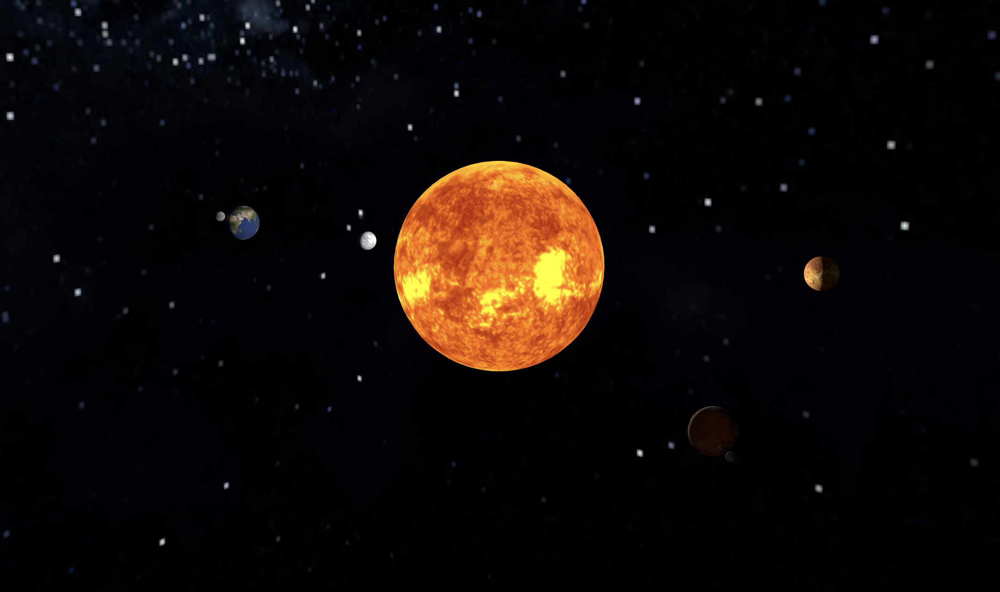

# 🌌 Solar System Simulation with Three.js

An **interactive 3D solar system** built with **Three.js**, featuring realistic planets, moons, and a starry space background. Explore the Sun, Mercury, Venus, Earth (with Moon), and Mars (with Phobos and Deimos) in real time with dynamic lighting and orbiting motions.

  <!-- Add a screenshot of your scene -->

---

## 🚀 Features

- **Realistic planets:** Mercury, Venus, Earth (with Moon), Mars (with Phobos and Deimos)  
- **High-resolution textures:** Sun and planets rendered with NASA-style textures  
- **Interactive camera:** Rotate, zoom, and pan using mouse controls  
- **Dynamic lighting:** Ambient and point lights simulate the Sun’s illumination  
- **Starry background:** Cube map for immersive space environment  
- **Responsive design:** Automatically adjusts to browser window size  

---


---

## 💻 Installation & Setup

To run locally:

 Clone the repository:

```bash
git clone https://github.com/DemazaZobel/solar-system-threejs
cd solar-system-threejs
 ```

## 🛠 Technologies Used

**Three.js**
 – WebGL 3D rendering library

**HTML5, CSS3, JavaScript** – Core web technologies


## Project Structure
solar-system-threejs/
│
├─ source/
│   ├─ index.html       # Main HTML file
│   ├─ script.js        # Three.js scene logic
│   ├─  styles.css       # Optional styling
│   └─ assets/
│       ├─ project.png
├─ static/
│   └─ textures/
│       ├─ 2K_earth_day_map.jpg
│       ├─ 2K_mars.jpg
│       ├─ 2K_mercury.jpg
│       ├─ 2K_moon.jpg
│       ├─ 2K_stars_milky_way.jpg
│       ├─ 2K_sun.jpg
│       ├─ 2K_venus_surface.jpg
│       └─ 8K_stars_milky_way.jpg
├─ .gitignore
├─ package-lock.json
├─ package.json
├─ vite.config.js
└─ README.md

## 🎮 Usage

Mouse drag: Rotate the camera around the solar system

Scroll wheel: Zoom in and out

Observe motions: Planets orbit the Sun, moons orbit their planets


## 📝 License

MIT License © 2026 **Betelhem Seleshi**


---

### ✅ Notes

Make sure **Vite serves textures** properly:
   - In your `script.js`, use paths like:

   ```js
   const earthTexture = textureLoader.load("/textures/2K_earth_day_map.jpg");
   const sunTexture = textureLoader.load("/textures/2K_sun.jpg");


Vite will **automatically** resolve /static/... to static/.
